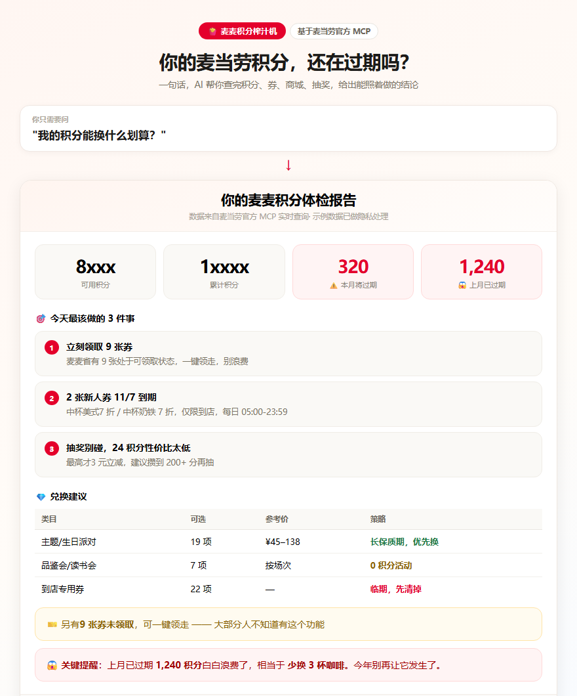

# 麦麦积分榨汁机 · McDonald's Points Maximizer

> 你的麦当劳积分、优惠券、抽奖次数，一次问清楚，一次用完。

[](https://github.com/M-China/mcd-developer-innovation-challenge)
[](https://github.com/M-China/mcd-mcp-server)



---

## 这是什么问题

你可能有过这样的经历：

- 麦当劳 App 里攒了几千积分，**不知道能换什么**，躺着慢慢过期
- 有一堆优惠券，**不知道哪张快过期了**，直到作废才想起来
- 每次点单都手动领券，**其实有一键领券**的功能，从来没用过
- 想兑换东西，但**不知道换哪个最划算**

「麦麦积分榨汁机」把这些事一次做完，并给你一份**能照着做的结论**。

## 它做什么

一句话问「我的积分能换什么划算」，它会：

| 能力 | 说明 |
|------|------|
| 🩺 **积分体检** | 汇总可用积分、冻结积分、**三个临期字段**，临期金额置顶提醒 |
| 💎 **兑换比价** | 拉取积分商城商品，算性价比锚点，优先推荐「长保质期」和「清临期」两类 |
| 🎫 **券包管理** | 汇总已持有券、临期券，并列出**还没领取**的券，可一键领券 |
| 🎰 **抽奖策略** | 算清每次消耗与奖品价值，判断是否值得抽，给出建议次数 |
| 📅 **活动提醒** | 查询当月营销活动，提示进行中与即将开始的活动 |

核心产出是一份 **「你的麦麦积分体检报告」**——积分总览 + 今天最该做的 3 件事 + 兑换建议表。

### 实际输出长这样

```markdown
## 你的麦麦积分体检报告

**积分总览**
- 可用积分：0
- ⏰ 本月将过期：0

🎯 今天最该做的 3 件事
1. 领取 9 张可领券
2. 用掉 2 张新人专享券（11/07 到期）
3. 注意券的每日可用时段 05:00-23:59

🎫 你的券包
- 已持有 2 张
- 未领取 9 张 → 可一键领取

🎰 抽奖评估：24 积分/次，性价比偏低，建议放弃
```

> 完整版报告见 [`样例输出_积分体检报告.md`](./样例输出_积分体检报告.md)（基于真实 MCP 查询数据生成）

## 目标用户

- 麦当劳会员，积分余额较高但长期闲置
- 习惯囤券但从不看有效期的人
- 想省事、不想逐个菜单翻找的用户

## 快速开始

### 前置条件

- 一个麦当劳中国账号与 MCP Token
- 支持 **Streamable HTTP** 协议的 MCP Client（WorkBuddy / Claude Code / Cursor / Cherry Studio / Trae等）

### 获取 MCP Token

1. 打开 <https://open.mcd.cn/mcp>
2. 右上角「登录」，使用手机号验证
3. 登录后点击「控制台」→「激活」申请 MCP Token
4. 同意服务协议后复制 Token

### 安装

**方式一：作为 Skill 使用（推荐）**

将本目录 `mcd-points-maximizer/` 复制到你的 Skills 目录：

```bash
# 用户级
cp -r mcd-points-maximizer ~/.workbuddy/skills/
```

**方式二：仅配置 MCP Server**

复制 `mcp-config.example.json` 为本地配置，把 `${MCD_MCP_TOKEN}` 替换为你的实际 Token。

推荐用环境变量注入（更安全）：

```bash
export MCD_MCP_TOKEN="你的实际Token"
```

WorkBuddy 中：【自定义连接器】→【配置MCP】，填入：

```json
{
  "mcpServers": {
    "mcd-mcp": {
      "type": "streamablehttp",
      "url": "https://mcp.mcd.cn",
      "headers": {
        "Authorization": "Bearer YOUR_MCP_TOKEN"
      }
    }
  }
}
```

保存后回到【自定义连接器】，将 `mcd-mcp` **启用**。

## 使用示例

| 你说 | 它会做 |
|------|--------|
| 我的积分能换什么划算？ | 查积分 → 拉商城 → 比价 → 输出体检报告（临期置顶） |
| 我的积分快过期了吗？ | 查账户 + 当前时间 → 定位临期积分 → 推荐能清掉的商品 |
| 帮我看看还有哪些券没领 | 列未领券 → 征得同意后一键领券 |
| 抽奖划算吗？ | 查活动 → 算期望值 → 给建议次数 |
| 我有什么券要过期了 | 查券包 → 标出临期券 → 提示使用场景 |
| 这个月麦当劳有什么活动 | 查活动日历 → 列出进行中与即将开始的活动 |

## 项目结构

```
mcd-points-maximizer/
├── SKILL.md                    # 核心技能定义与工作流
├── mcp-config.example.json     # 脱敏 MCP 配置示例
├── CONTEST_DECLARATION.md      # 参赛声明（官方原文，不可修改）
├── MCP_INTEGRATION.md          # MCP 集成说明
├── workbuddy.md                # WorkBuddy 开发记录
├── SECURITY.md                 # Token 安全说明
├── references/
│   └── tool-reference.md       # 工具清单与调用流程
└── 样例输出_积分体检报告.md      # 真实数据产出的报告样例
```

## 技术要点

- **纯 Skill 形态**，零依赖、无需构建
- **并行查询**：积分/券/商城/抽奖互不依赖，同轮并行发起
- **时间锚定**：所有过期判断先取 `now-time-info`，避免逻辑错误
- **合规**：不含真实 Token，不做健康建议，危险操作前必先确认

## 致谢

本项目为**2026 麦当劳程序员创意开发大赛**参赛作品，基于[麦当劳中国官方 MCP Server](https://github.com/M-China/mcd-mcp-server) 能力开发，使用 [腾讯 WorkBuddy](https://www.workbuddy.cn) 辅助开发。

感谢麦当劳中国开放 MCP 能力，让开发者能在真实场景里做出有意义的小工具。

## 免责声明

本项目为参赛作品，**非麦当劳官方产品**，与麦当劳中国无隶属关系。

项目输出仅供参考，不构成医疗、营养或其他专业建议；餐品信息、价格及供应状态以麦当劳官方渠道的实时结果为准。数据均来自麦当劳官方 MCP 实时查询。

## License

MIT